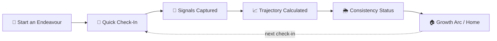
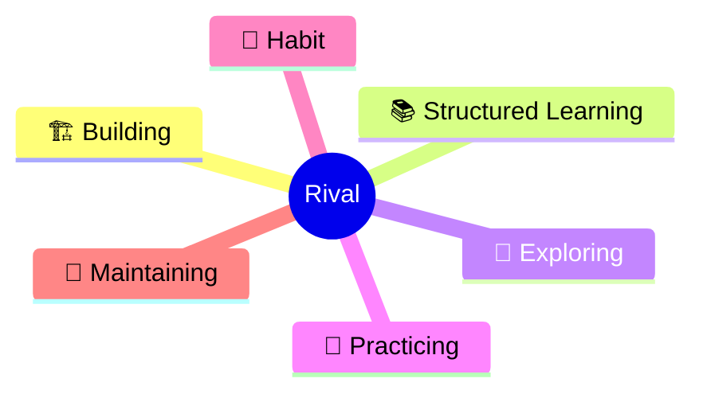

<div align="center">


[](https://conventionalcommits.org)

</div>

---

### Table of Contents
- [What Is Rival](#what-is-rival)
- [The Philosophy](#the-philosophy)
- [How It Works](#how-it-works)
- [The Six Domains](#the-six-domains)
- [Rival vs. The Rest](#rival-vs-the-rest)
- [Features](#features)
- [Design Language](#design-language)
- [Your Data, Your Rules](#your-data-your-rules)
- [Getting Rival](#getting-rival)
- [Contributing](#contributing)
- [License](#license)

---

## What Is Rival

Rival is a growth-tracking app built on one refusal: **it will not compare you to anyone else.**

No leaderboards. No strangers. No cohort averages telling you you're "behind." You pick the things you're actually trying to grow — a project, a skill, a language, a habit — and Rival tracks *your* trajectory against nothing but your own past self.

It's not a productivity tracker, and it's not a habit-streak app pretending a broken chain means failure. It's built around a simpler idea: **growth compounds even when it doesn't look like it, and the only rival worth measuring yourself against is the version of you from last month.**

## The Philosophy

> *Life isn't a race. You can never ungrow. Showing up only grows you.*

That line runs through every design decision in this app. There's no vanity number waiting on the home screen to spike a feeling in half a second. There's no anonymized "people like you" comparison — it was designed, considered, and deliberately thrown out. The only ghost you race is your own.

## How It Works



You start an **Endeavour** — anything you're trying to grow. Every so often, you do a short check-in. Rival doesn't ask the same rigid script every time; it asks what's actually useful *right now*, based on what it already knows. Those answers become signals, the signals feed a trajectory, and the trajectory tells you — honestly, without spin — where you're headed.

## The Six Domains

Every Endeavour lives inside one of six Domains, because "building a startup" and "keeping up a stretching habit" shouldn't be measured the same way.

| Domain | What It's For |
|---|---|
| 🏗️ **Building** | Making something from nothing — a project, a product, a body of work |
| 📚 **Structured Learning** | Following a course, curriculum, or deliberate learning path |
| 🧭 **Exploring** | Open-ended curiosity, no fixed destination — just movement |
| 🎯 **Practicing** | Repetition toward mastery of a skill you already have |
| 🌱 **Habit** | Something still forming, not yet automatic |
| 🔁 **Maintaining** | Something already automatic — showing up just to keep it alive |



## Rival vs. The Rest

| Most Growth Apps | Rival |
|---|---|
| Leaderboards, streaks, strangers | Ghost-self racing — you vs. past-you, nobody else |
| One vanity score the moment you open it | A smoothed trajectory that won't panic over one bad day |
| The same fixed questions, every single day | Adaptive check-ins that ask what's actually useful |
| Delete what you didn't finish | A Graveyard & Hall of Honor — nothing just disappears |
| Your data on someone else's server | Your data, in your own Google Drive |

## Features

<details>
<summary><strong>🎯 Endeavours & Adaptive Check-Ins</strong></summary>
<br>
Track anything you're growing. Check-ins aren't a fixed script — the questions adapt to what actually needs an answer, so you're never grinding through irrelevant boxes just to log a day.
</details>

<details>
<summary><strong>📈 Trajectory, Not Just a Score</strong></summary>
<br>
Rival tracks where you're <em>headed</em>, smoothed over time — so one bad week doesn't torch your whole story, and one good day doesn't inflate it into something it isn't.
</details>

<details>
<summary><strong>🌦️ Consistency Status</strong></summary>
<br>
Your rhythm gets a plain-language read, not a shame-based streak counter:<br><br>

🟢 <strong>Dialed In</strong> · 🟢 <strong>On Track</strong> · 🟡 <strong>Finding Footing</strong> · 🟡 <strong>Uneven Ground</strong> · 🟠 <strong>Choppy Waters</strong> · 🔴 <strong>Off Course</strong> · 🔴 <strong>In The Storm</strong><br><br>
Every label was written to describe weather, not to punish you for having a bad one.
</details>

<details>
<summary><strong>👻 Ghost-Self Racing</strong></summary>
<br>
Race your own past trajectory. That's it. That's the only leaderboard Rival will ever have.
</details>

<details>
<summary><strong>📖 Endeavour Biography</strong></summary>
<br>
Every Endeavour gets a narrative timeline, not just a chart — the actual story of how it grew, stalled, and came back.
</details>

<details>
<summary><strong>🪦 The Graveyard & Hall of Honor</strong></summary>
<br>
Closing an Endeavour doesn't delete it. Finished or abandoned pursuits get remembered, not erased — the growth counted even if the thing itself didn't survive.
</details>

<details>
<summary><strong>🏠 A Home Screen With No Vanity Metrics</strong></summary>
<br>
No big hero number designed to spike a feeling on open. Home shows what actually needs you: pending check-ins, a summary per Domain, and your most active Endeavours.
</details>

<details>
<summary><strong>💡 Daily Insight</strong></summary>
<br>
A short, generated reflection surfaced on Home — noticing a pattern in your own data before you'd have thought to look for it.
</details>

> *Growth isn't a hero number. It's showing up even when the status says you're in a storm.*

## Design Language

Rival's visual identity runs on **Clash Display** for headings and **Satoshi** for body text, in a palette that leans **electric lavender** and **cosmic ember** — moody, warm, a little galactic.

<p>
  
  
  
  
  <br><sub>mood, not the final spec</sub>
</p>

Trajectories aren't shown as a flat line on a boring chart — they're rendered as a spiral, because growth was never supposed to be a straight line anyway.

## Your Data, Your Rules

Rival has no hosted backend and no central database quietly collecting your check-ins. Your data lives in **your own Google Drive**, synced privately between your own devices. There's no Rival server to breach, because there's no Rival server holding your data in the first place. (Google Drive today, with more providers planned.)

## Getting Rival

Rival installs straight from your browser — no app store, no account with Rival itself:

- **Desktop (Chrome / Edge):** click the install icon in the address bar → Rival installs like a native app.
- **Android (Chrome):** menu → *Add to Home Screen.*
- **iOS (Safari):** Share → *Add to Home Screen.*

No app store, no multi-hundred-MB download, no waiting on a review queue for updates — it's a PWA, so updates just land.

## Contributing

This is the one section where the code gets a mention.

1. **Read the nearest `architecture.md` before you touch anything.** If a subsystem has one, it exists so you get the *why*, not just the *what* — read it before changing behavior in that area.
2. **No `architecture.md` for the part you're touching? Write one.** Future contributors (including future-you) need the context you're holding right now, not an archaeology project six months from now.
3. **Keep it current.** A stale architecture doc is worse than no doc at all — if your change invalidates something it claims, update it in the same PR, not "later."

**Commits follow [Conventional Commits](https://www.conventionalcommits.org/), no exceptions:**

```
<type>(<optional scope>): <description>

feat(check-in): add adaptive question budget
fix(trajectory): correct z-score banding at low sample counts
docs(domains): update architecture.md for domain exclusions
refactor(rules): migrate synergy logic into archetype engine
chore: bump dependencies
```

Allowed types: `feat`, `fix`, `docs`, `refactor`, `perf`, `test`, `style`, `chore`. PRs with commit messages that don't follow this format get bounced back before review, not during it.

## License

TBD — until a license lands here, treat this as all-rights-reserved.

---

<div align="center">


<sub>Built solo, obsessively, in Bangalore 🌌 — Rival isn't trying to beat anyone. Just yesterday's you.</sub>
</div>
