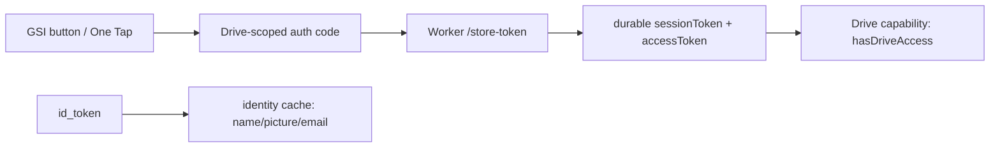
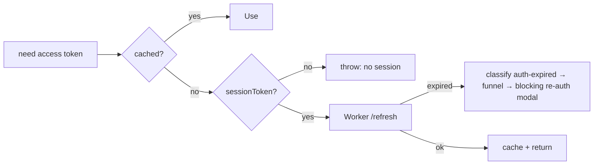

# `src/auth` — Google Identity & Drive Session

The **authentication layer** of Rival: Google Identity Services (GSI) sign-in, the durable Drive session token, the Cloudflare Worker client that refreshes it, and the high-level `auth.ts` that coordinates it all.

> **One-sentence purpose:** _Sign the user in with Google, hold a durable Drive
> session, and resolve a valid access token — with app-session expiry classified
> and surfaced through the error funnel as a blocking re-auth._

```
   dependency direction (low → high)
   ┌────────────────────────────┐
   │ auth/authSession           │  (pure localStorage session slots)
   ├────────────────────────────┤
   │ auth/driveWorkerClient     │  (Cloudflare Worker: store/refresh/revoke)
   │ auth/driveToken            │  (OAuth access-token cache — auth-owned)
   ├────────────────────────────┤
   │ auth/auth                  │  (the coordination + token resolution)
   └─────────▲──────────────────┘
             │ consumed by viewmodels + sync
```

---

## File-by-file map

| File                   | Responsibility                                                                                                                                                                                 | Public surface                                                                                                                                                                               |
| ---------------------- | ---------------------------------------------------------------------------------------------------------------------------------------------------------------------------------------------- | -------------------------------------------------------------------------------------------------------------------------------------------------------------------------------------------- |
| `authSession.ts`       | Pure localStorage session persistence — id_token, session token, identity cache; same-tab subscriber set; unverified JWT decode (display-only); sign-in-boundary claim validation (issuer/audience/expiry) | `GoogleUser`, `StoredIdentity`, `DecodedIdToken`, `decodeIdToken`, `validateIdTokenClaims`, `get/setStoredIdentity\|IdToken\|SessionToken`, `toGoogleUser(FromProfile)`, `subscribeAuthChange`, `notifyAuthListeners` |
| `gsiClient.ts`         | Google Identity Services — branded button + One Tap; requests a Drive-scoped auth code; routes identity-flow errors; origin-aware code-flow timeout copy | `initIdentityFlow`, `buildIdentityFlowHandle`, `requestDriveCode`, `identityFlowErrorToMessage`, `buildCodeFlowTimeoutMessage`, `currentOrigin`, `DRIVE_FILE_SCOPE`, `IdentityFlowHandle`, `GsiAccountsIdLike`, `UNCONFIGURED_MESSAGE` |
| `driveWorkerClient.ts` | Pure HTTP client to the Cloudflare Worker — `/store-token`, `/refresh`, `/revoke`                                                                                                              | `storeToken`, `refreshToken`, `revokeServerToken`, `StoreTokenResult`, `RefreshTokenResult`, `SessionProfile`                                                                                |
| `driveToken.ts`        | Lifecycle of the short-lived Drive access token — memory + localStorage cache, expiry-aware. Auth-owned (was `sync/driveToken`); `sync` imports it from here so the auth→sync coupling is gone | `createDriveTokenStore()`, `driveTokenStore`                                                                                                                                                 |
| `auth.ts`              | The coordination — complete sign-in (gated on origin + token claims), connect Drive, token resolution, sign-out, auth observation                                                                   | `completeIdentitySignIn`, `connectDrive`, `getDriveAccessToken`, `signOut`, `observeAuthState`, `hasDriveAccess`, `getStoredUser`                                                            |

---

## The session model

Identity is the server-authoritative `id_token` + an `identity` cache rebuilt from `/refresh`; the Drive capability is the long-lived `sessionToken`. The client keeps the `id_token` only to decode display profile — it may expire on Google's side but the client never needs a fresh one once signed in.

## The sign-in gate

`completeIdentitySignIn` refuses to sign in unless BOTH hold: the current page origin is in the app's own allowlist (`VITE_AUTHORIZED_ORIGINS`, checked against the exact scheme + host + port), and the presented token's claims validate (Google issuer, this client's audience, unexpired). The allowlist exists because Google enforces its Authorized JavaScript origins inconsistently across GSI surfaces — One Tap / FedCM can issue a token at an origin the OAuth code-flow page rejects (`400 origin_mismatch`) — so the app blocks sign-in anywhere it can't verify authorization. `connectDrive` applies the same origin gate before opening the code-flow popup, and the popup timeout carries the failing origin for diagnosis.



## Token resolution + the runtime link

`getDriveAccessToken()` returns a valid token from the cache or refreshes via the
Worker. **When the refresh reports the session expired** (`no_refresh_token`), it
classifies the failure as `auth-expired` (`ErrorClassifier.fromAuthWorkerError`) and
throws the `AppError` — the single error funnel then surfaces one blocking re-auth
modal with a "Sign in" action, instead of the expiry being silently swallowed or
double-surfaced by whichever call hit it.



App-auth and Drive-data auth are distinct:

- An app-auth failure (dead `/refresh` session or denied identity) prompts **app re-auth**, which
  re-establishes the durable session and re-grants the Drive scope when Drive-sync is opted in.
- A Drive-data `403` while the app session is valid is a **Drive-only** denial
  (`auth-denied`) — it prompts reconnect Drive without demanding app re-auth.
- A Drive-data `401` (stale short-lived access token) is silently refreshed via the Worker.

## Cross-account guard

`completeIdentitySignIn` revokes any Drive session owned by a _different_ Google account before signing in, so the new identity never silently inherits another account's Drive tokens.

---

## Cross-package connections (one level deeper)

### Inbound — what `auth` imports

- `@/core/env` — `googleClientId`, `isAuthorizedGoogleOrigin`, `driveTokenFunctionUrl`
- `@/core/logging` — `Logger.auth`
- `@/domain/errors` — `ErrorClassifier` (classifies session expiry); surfaced via the reporter funnel

### Outbound — who consumes `auth`

| Consumer                      | What it uses                                                                        |
| ----------------------------- | ----------------------------------------------------------------------------------- |
| `src/sync`                    | `connectDrive`, `getDriveAccessToken`, `getStoredUser`, `hasDriveAccess`            |
| `src/viewmodels`              | `useSignInViewModel`, `useSettingsViewModel` (sign-in, connect Drive, observe auth) |
| `src/shells/auth/RequireAuth` | gating `/app` on a signed-in user                                                   |

---

## Testing

`authSession.test.ts` and `gsiClient.test.ts` cover session persistence and GSI behavior against the in-memory `localStorage` provided by `src/test/setup.ts`.

```bash
npx vitest run --config vite.config.ts src/auth
```

