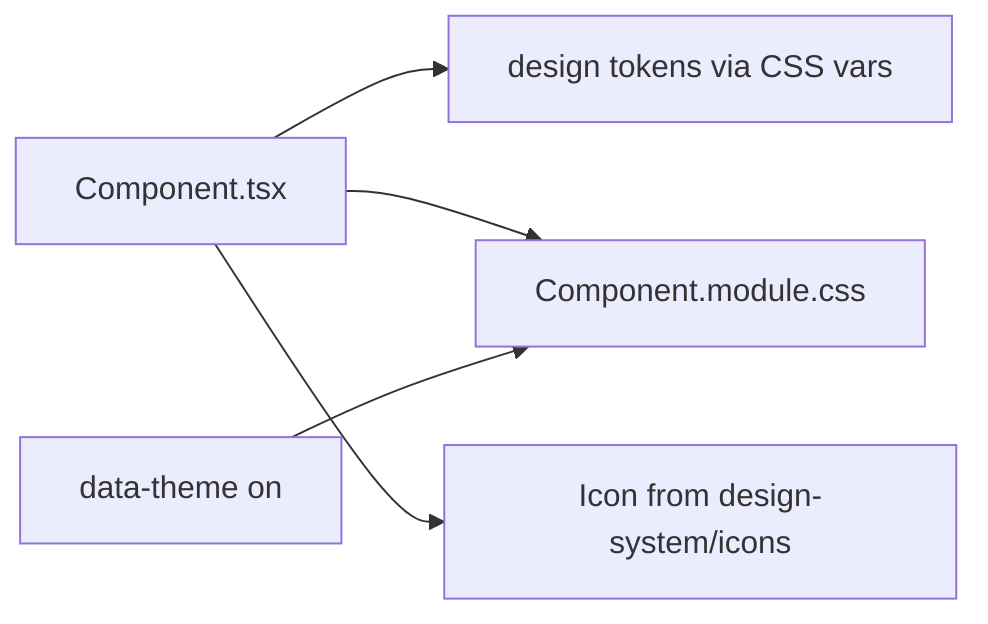

# `src/components` — UI Primitives

The **reusable UI component library** of Rival: self-contained, design-system- driven primitives (button, dialog, toast, alert, input, loader, ...) plus a few composite/specialized components. Each lives in its own folder with a `*.module.css`.

> **One-sentence purpose:** _Provide a small, consistent set of UI primitives the
> screens and shells compose — styled entirely through design tokens._

```
   ┌──────────────────────────────┐
   │ design-system (tokens · icons)│  ← the styling + icon source of truth
   ├──────────────────────────────┤
   │ components/* (primitive folders)│
   │   alert · button · dialog · toast · input · loader · icon · ... │
   └──────────▲───────────────────┘
              │ consumed by screens + shells + runtime renderers
```

---

## The primitive map

| Component                               | Responsibility                                                               |
| --------------------------------------- | ---------------------------------------------------------------------------- |
| `alert/Alert`                           | Inline status/alert banner (info/warning/error/success) with optional action |
| `button/Button`                         | The primary button, with variants (`hero/primary/secondary/danger/ghost`)    |
| `card/Card`                             | A surface container                                                          |
| `dialog/Dialog`                         | Modal dialog (portal, size variants, esc/overlay close)                      |
| `dialog/BlockingDialog`                 | The arbitrated single blocking modal (no auto-close, action-driven)          |
| `toast/Toast`                           | Transient toast + `ToastContainer` (fixed bottom stack, own auto-dismiss)    |
| `input/Input`, `input/Stepper`          | Text input + numeric stepper                                                 |
| `loader/Loader`                         | The branded loading spinner (theme-aware)                                    |
| `icon/Icon`                             | Renders a named icon from the design-system set                              |
| `icon-button/IconButton`                | An icon-only button                                                          |
| `divider/Divider`                       | A horizontal/vertical rule                                                   |
| `badge/Badge`, `badge/ConsistencyBadge` | Labels / status badges                                                       |
| `sheet/Sheet`                           | A bottom/edge sheet panel                                                    |
| `progress-dots/ProgressDots`            | Step indicator                                                               |
| `logo/Logo`                             | The brand mark                                                               |
| `typography/Typography`                 | Typographic helpers                                                          |
| `flow-shell/FlowShell`                  | A titled, back-able flow screen frame                                        |
| `trend-chart/*`                         | The trajectory visualization (interactive 2D, minimal 2D, and 3D)          |
| `utils.ts`                              | `cx(...)` class-name combiner                                                |

---

## How a primitive is structured

Each primitive is a folder with a `*.tsx` component + a `*.module.css` scoped style module. Styles read **design tokens** (`var(--...)`) from the design system, so they react to theme automatically.



## The runtime connection

The runtime feedback framework's renderers (`src/shells/runtime`) **reuse these
primitives** rather than re-implementing visuals:

- `RuntimeNotices` → `Alert`
- `RuntimeToasts` → `Toast` + `ToastContainer` (which owns auto-dismiss)
- `RuntimeBlockingDialog` → `Dialog`
- actions → `Button`

This is the DRY guarantee: the runtime draws through the design system, never
around it.

---

## Cross-package connections (one level deeper)

### Inbound — what `components` imports

- `@/design-system/icons` — `IconName`
- `@/theme` — `useTheme` (Loader, Logo)
- `@/domain/trajectory` — `ConsistencyStatus` (ConsistencyBadge)

### Outbound — who consumes `components`

| Consumer                    | What it uses                                                     |
| --------------------------- | ---------------------------------------------------------------- |
| `src/shells/screens/*`      | Alert, Button, Dialog, Input, Sheet, FlowShell, ...              |
| `src/shells/*`              | Nav, Alert, Toast, Dialog, Button (AppShell + runtime renderers) |
| `src/design-system/docs/ui` | primitives to render live doc examples                           |

---

## Testing

Primitives are largely presentational; behavioral coverage lives in the
design-system docs playground and component usages across screens.

```bash
npx vitest run --config vite.config.ts src
```

