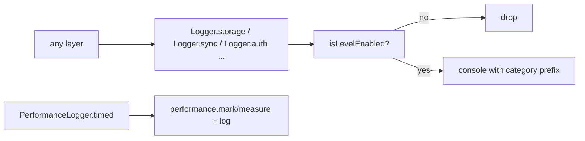

# `src/core` — Infrastructure & Runtime

The **framework-free infrastructure** of Rival: environment access, the logging sink, and the runtime feedback framework. `core` is the strict contract for code that has no React, no design-system imports, and no product knowledge — it is the layer everything else may depend on.

> **One-sentence purpose:** _Provide the dependency-free base — environment, logging, and the runtime message/feedback machinery — that every other layer builds on._

```
   dependency direction (low → high)
   ┌─────────────────────┐
   ├─────────────────────┤
   │ core/env            │  read-only env access
   │ core/logging        │  the logger every layer uses
   ├─────────────────────┤
   │ core/runtime        │  monitors + transport + coordinator
   └─────────▲───────────┘
             │ consumed by all of
   ┌─────────┴───────────┐
   │ domain · data · sync│ auth · shells · viewmodels
   └─────────────────────┘
```

---

## File/folder map

| Path                    | Responsibility                                                 | Public surface                                                                            |
| ----------------------- | -------------------------------------------------------------- | ----------------------------------------------------------------------------------------- |
| `env.ts`                | Read-only typed env access — mode, OAuth client id, Worker URL | `getEnvMode()`, `googleClientId()`, `driveTokenFunctionUrl()`, `getEnvString()`           |
| `logging/config.ts`     | Log level plumbing + mutable active config                     | `LogLevel`, `LOG_LEVEL_ORDER`, `activeConfig`, `resolveEnvironmentDefault()`              |
| `logging/categories.ts` | The closed set of log categories                               | `CategoryId`, `CategoryDefinition`, `CATEGORIES`                                          |
| `logging/logger.ts`     | Scoped loggers + performance wrapper                           | `Logger.{behavior,checkIn,sync,storage,network,auth,ui,navigation,analytics,performance}` |
| `runtime/`              | The feedback framework — see its own `ARCHITECTURE.md`         | `createRuntime`, `getRuntime`, monitors, cross-tab, coordinator                           |

---

## The logging layer

`core/logging` is the **single logging sink** in the app. Every layer (domain, are a closed set (`storage`, `network`, `auth`, `sync`, ...) with per-category data, sync, auth, runtime) logs through it, never `console` directly. Categories minimum levels and a `PerformanceLogger` for timing.



`runtime/errors/reporter` uses `Logger.ui` for the error funnel; the coordinator uses `Logger.network`/`Logger.storage`; `core/runtime` never re-implements logging — it reuses this layer (a key DRY guarantee).

---

## The runtime framework

`core/runtime` is the browser-coupled infra (connectivity + storage monitors, cross-tab transport, PWA updater, and the coordinator). It is **framework-free** but reads the real `navigator`. It depends on `domain/notifications` (the bridge it raises onto) and `domain/errors` (whose retry queue it wakes). The React bindings live in `src/shells/runtime`, _not_ in core — keeping core free of React.

See `runtime/ARCHITECTURE.md` for the full detail.

---

## Cross-package connections (one level deeper)

### Inbound — what `core` imports

`core` imports only `@/domain/notifications` and `@/domain/errors` (from the runtime), and itself. It does **not** import `data`, `sync`, `auth`, or any UI.

### Outbound — who consumes `core`

| Consumer             | What it uses                                                                                        |
| -------------------- | --------------------------------------------------------------------------------------------------- |
| `src/auth`           | `@/core/env` (client id, worker URL), `@/core/logging`, `@/core/runtime/coordinator` (`getRuntime`) |
| `src/data`           | `@/core/logging`                                                                                    |
| `src/sync`           | `@/core/logging`, `@/core/runtime/coordinator` (`getRuntime`)                                       |
| `src/domain/*`       | `@/core/logging`                                                                                    |
| `src/shells/runtime` | `@/core/runtime/*` (createRuntime, monitors, cross-tab)                                             |
| `src/viewmodels`     | `@/core/logging` where needed                                                                       |

---

## Testing

`core/runtime` has `connectivity.test.ts`; `core/logging` is validated by its callers. The pure framework tests live in `domain/notifications`, `domain/errors`, and `core/runtime`.

```bash
npx vitest run --config vite.config.ts src/core
```
