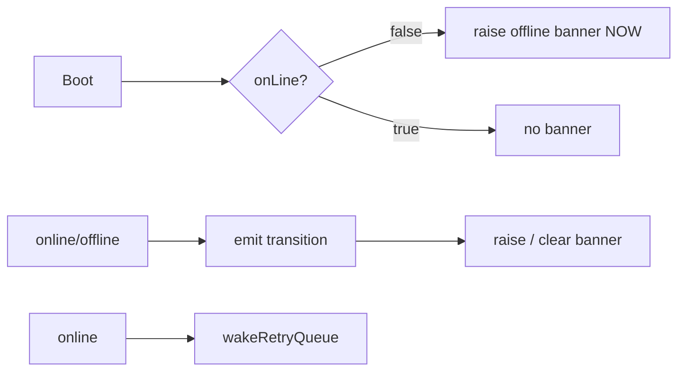
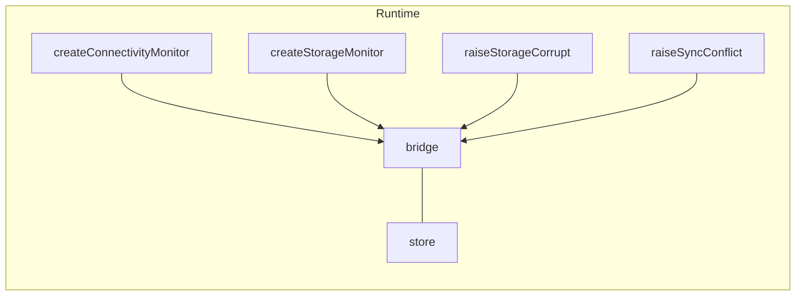

# `src/core/runtime` — Monitors, Transport, Coordinator

The **framework-free, browser-coupled infrastructure** of the runtime feedback framework: the monitors that observe the real world (connectivity, storage), the cross-tab transport that keeps every open tab in sync, the PWA updater, and the **coordinator** that is the single glue wiring all of it onto the message bridge.

> **One-sentence purpose:** _Observe the ambient state of the app (online? storage pressure? a new build? another tab?) and funnel it onto one message bridge the rest of the framework renders._

**This package is framework-free** (no React, no design system) but it _is_ browser-coupled — the monitors read the real `navigator`. It sits in the middle of the framework, consuming the pure packages below it and feeding the React layer above it.

```
   dependency direction (low → high)
   ┌───────────────────────────┐
   │ domain/notifications      │  (message lifecycle — the bridge we raise on)
   └───────────▲───────────────┘
               │
   ┌───────────┴───────────────┐
   │ domain/errors             │  (withRetry — we wake its queue on reconnect)
   └───────────▲───────────────┘
               │
   ┌───────────┴───────────────┐
   │ core/runtime              │  ◄── this package
   └───────────▲───────────────┘
               │
   ┌───────────┴───────────────┐
   │ shells/runtime (React)    │  ← mounts us; services call getRuntime()
   └───────────────────────────┘
```

---

## File-by-file map

| File              | Responsibility                                                                                                                                                   | Public surface                                                             |
| ----------------- | ---------------------------------------------------------------------------------------------------------------------------------------------------------------- | -------------------------------------------------------------------------- |
| `connectivity.ts` | Boot-offline connectivity monitor — emits **current** state, then transitions                                                                                    | `createConnectivityMonitor()`, `ConnectivityEvent`, `ConnectivityListener` |
| `storage.ts`      | Proactive storage-pressure monitor — samples `estimate()` at boot + on a timer                                                                                   | `createStorageMonitor()`, `StoragePressureSignal`, `StorageMonitorOpts`    |
| `crossTab.ts`     | Typed `BroadcastChannel` transport with a `storage`-event fallback                                                                                               | `createCrossTabBus()`, `CrossTabEventBus`, `RuntimeChannelEventMap`        |
| `pwa.ts`          | New-build updater — broadcasts across tabs, each tab offers Reload                                                                                               | `createPwaUpdater()`, `PwaUpdateHook`, `PwaUpdaterOpts`, `crossTabBus`     |
| `coordinator.ts`  | The **single owner** of the app runtime — `getRuntime()` lazily creates the one Runtime wiring monitors onto the bridge; `createRuntime(opts)` is module-private | `getRuntime()`, `Runtime`, `RuntimeOpts`                                   |

## The monitors

### `createConnectivityMonitor`

`start()` reads the **current** `navigator.onLine` and emits it immediately, then reacts to `online`/`offline` transitions — so an offline boot raises the banner instead of waiting for a state change. The coordinator clears the `conn` banner on `online` and raises it on `offline` — and **wakes `withRetry`'s queue** on reconnect so silent backoffs fire instantly.



### `createStorageMonitor`

The fix for "you only find out about storage after a `QuotaExceededError`." It samples `provider.estimate()` at startup + every `intervalMs`, keeps a latched `over` flag, and fires a `{ type: "pressure" }` event the first time `usage/quota ≥ warnRatio` (default 0.9), `{ type: "relief" }` when it drops back under. Sampling never throws — an unavailable or erroring provider simply keeps the monitor dormant.

```ts
const monitor = createStorageMonitor({ provider: navigator.storage, warnRatio: 0.9 });
monitor.subscribe((event) => {
  if (event.type === "relief") {
    bridge.clear("storage-pressure");
    return;
  }
  bridge.raise({ key: "storage-pressure", ...event });
});
monitor.start();
```

### `createCrossTabBus`

A typed, structured-clone-safe `BroadcastChannel` with a `storage`-event fallback when the channel is unavailable. Events are `RuntimeChannelEventMap`-typed (`app:update`, `app:data-changed`, `app:sync`). Crucially, **functions never cross the bus** — so each tab builds its own actions locally rather than leaking closures across the seam. Each bus is a distinct "tab" (`instanceId`), and delivery is guarded by `sourceInstance` so a tab never hears its own broadcast.

### `createPwaUpdater`

Wraps vite-plugin-pwa's `onNeedRefresh` lifecycle: when a new build is staged, it broadcasts `app:update` on the bus so every tab learns of it. The actual `registerSW` call lives in the React layer (shells), keeping this package free of Vite's `virtual:*` modules — the updater only needs a `PwaUpdateHook`. Call `start()` to wire it, `stop()` to tear it down.

---

## The coordinator — the single glue

`getRuntime()` is the one place that knows how monitors, the bridge, and the store fit together; `createRuntime(opts)` is module-private and invoked once, lazily, by the accessor. The returned `Runtime` exposes the app-facing methods (so services never touch the bridge directly):



| Method                                       | Kind         | Blocking                                                      | Wired by       |
| -------------------------------------------- | ------------ | ------------------------------------------------------------- | -------------- |
| `raiseStorageCorrupt`                        | `corruption` | blocking, priority `CORRUPTION` (2), `once`                   | data layer     |
| `raiseSyncConflict`                          | `sync`       | passive banner                                                | sync layer     |
| `clearSyncConflict`                          | —            | clears the conflict after resolution                          | sync layer     |
| `setReconcileHandler`                        | —            | wires the Reconcile action's callback                         | shells         |
| `setAuthRecovery` / `setAuthDeferred`        | —            | wires the Drive-denied blocker's recover/defer CTAs           | shells/runtime |
| `setSessionExpiredHandler`                   | —            | app-session expiry → shell signs out to `/auth`               | shells/runtime |
| `setDriveSyncEnabled` / `isDriveSyncEnabled` | —            | durable Drive opt-in flag gating ambient surfaces + auto-sync | syncService    |

App-auth failures no longer raise through the coordinator: `auth.ts` classifies a dead session
(`auth-expired`) and `sync` classifies a denied grant (`auth-denied`), and the single error funnel
(`reportError`) surfaces them as blocking modals; the coordinator translates classified auth
interests into a wired re-auth action. The coordinator owns
only the monitor-driven + reconcile interests listed above.

### `getRuntime()` — the one runtime, for shell and services alike

`RuntimeProvider` mounts monitors and draws; `syncService.ts` raises the Reconcile interest and viewmodels run outside React. Both sides use the same accessor. `getRuntime()` returns **the** lazily-created singleton store+runtime (not a per-caller fallback), so a service firing before first paint raises onto the exact store the shell later draws — there is never a second instance.

Monitors are mounted lazily by the shell via `start()`/`stop()`: `start()` re-arms connectivity + storage subscriptions and `stop()` tears them down symmetrically, so repeated start from StrictMode remounts never stacks duplicate monitors. Shell-only concerns (`registerSW`, error-reporter funnel) stay in the React layer and call the same runtime's `setReconcileHandler(...)`/`start()`.

```ts
// in auth.ts — outside React:
throw ErrorClassifier.fromAuthWorkerError(err); // app-auth expiry → funnel → blocking re-auth modal
// in syncService.ts:
getRuntime().raiseSyncConflict({ body }); // Drive 409 → Reconcile banner
```

The auth-vs-drive split, driven through the same classifier:

- **Drive-data `401`** (stale access token) — silently refreshed via the Worker; never surfaced.
- **App session expired** (`/refresh` `no_refresh_token`, i.e. app-auth `401`) → `auth-expired` → re-auth.
- **Drive-data `403`** (denied grant, valid session) → `auth-denied` → reconnect Drive only.
- **App-auth `403`** → `auth-denied` → re-auth (permission scope re-granted when Drive-sync opted in).

---

## Cross-package connections (one level deeper)

### Inbound — what `core/runtime` imports

| Package                     | Symbol(s)                                                                                             | Why                                                              |
| --------------------------- | ----------------------------------------------------------------------------------------------------- | ---------------------------------------------------------------- |
| `@/domain/notifications/*`  | `createBridge`, `createRuntimeStore`, `RuntimeInterest`, `BLOCKING_PRIORITY`, `createReconcileAction` | builds + raises onto the message bridge; wires the Reconcile CTA |
| `@/domain/errors/withRetry` | `wakeRetryQueue`                                                                                      | fires silent backoffs on reconnect                               |

`ConnectivityEnv` and `StorageProvider` are **defined in `core/runtime` itself** (`connectivity.ts`, `storage.ts`) — browser-environment shapes belonging to the runtime layer, not the pure `domain` vocabulary.

### Outbound — who consumes `core/runtime`

| Consumer                       | What it uses                                                            | When                                                             |
| ------------------------------ | ----------------------------------------------------------------------- | ---------------------------------------------------------------- |
| `src/sync/syncService.ts`      | `getRuntime().raiseSyncConflict`                                        | a Drive 409 → the Reconcile banner                               |
| `src/shells/runtime/react.tsx` | `getRuntime` (start/stop/setReconcileHandler), `crossTabBus`, `Runtime` | the provider mounts the coordinator's single runtime + wires PWA |

---

## Testing

`src/core/runtime/connectivity.test.ts` covers:

- **Boot-offline** — `createConnectivityMonitor` emits the current state at `start()`, so an already-offline app warns immediately.
- **Transitions** — subsequent `offline`/`online` events emit in order.
- **Cross-tab** — a fake `BroadcastChannel` delivers a broadcast from one tab to another but never back to the sender.

```bash
npx vitest run --config vite.config.ts src/core/runtime
```

