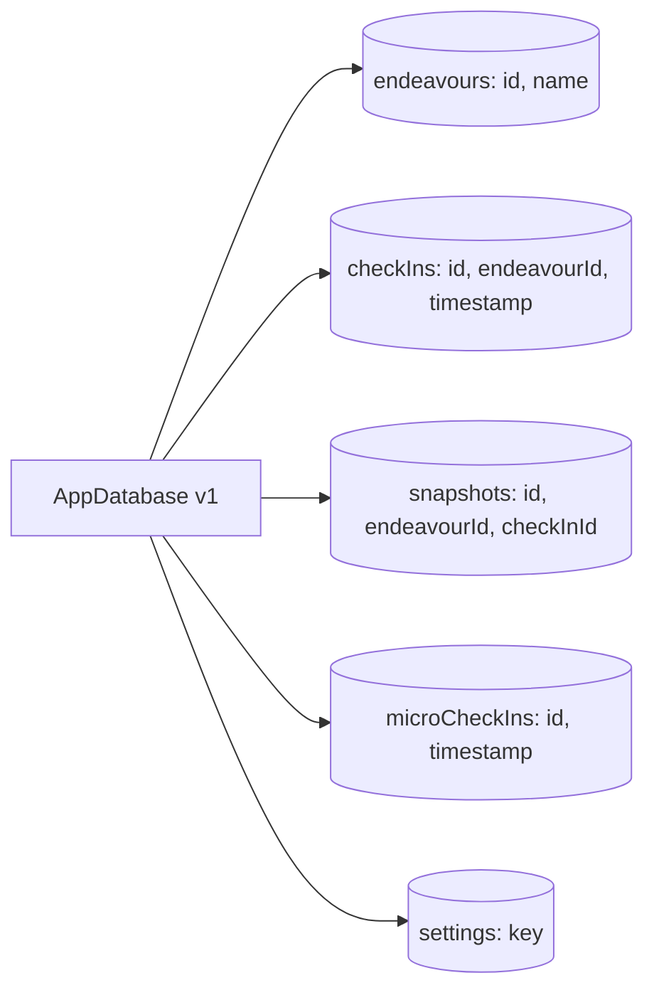

# `src/data` — Persistence

The **local persistence layer** of Rival: the Dexie/IndexedDB schema, the
repositories that wrap it, and the small set of live-query hooks the UI reads
through. It is the boundary between pure domain knowledge and durable state.

> **One-sentence purpose:** _Persist and retrieve every domain entity through a
> thin, typed repository over Dexie — the only layer that touches IndexedDB._

```
   dependency direction (low → high)
   ┌────────────────────────────┐
   │ domain/models              │  (entity contracts: Snapshot, CheckIn,
   │                            │   Endeavour, DomainSegment)
   ├────────────────────────────┤
   │ data/schema                │  (Dexie table row shapes)
   ├────────────────────────────┤
   │ data/db                     │  (the Dexie database + versioning)
   ├────────────────────────────┤
   │ data/repositories           │  (typed data access)
   └─────────▲──────────────────┘
             │ consumed by viewmodels + shells
```

---

## File-by-file map

| Path | Responsibility | Public surface |
|------|----------------|----------------|
| `db.ts` | The Dexie `AppDatabase` + table versioning | `AppDatabase`, `db` (singleton) |
| `schema/Endeavour.ts` | ~~`Endeavour` + `DomainSegment` + `activeSegment()`~~ — removed; contracts now live in `domain/models/Endeavour.ts` (kept as persistence rows only) | `—` |
| `schema/CheckIn.ts` | ~~`CheckIn` + `Response`~~ — removed; contracts now live in `domain/models/CheckIn.ts` | `—` |
| `schema/Snapshot.ts` | ~~`Snapshot`~~ — removed; contract now lives in `domain/models/Snapshot.ts` | `—` |
| `schema/MicroCheckIn.ts` | daily non-GIS mood rows | `MicroCheckIn` |
| `schema/AppSettings.ts` | settings key-value rows + `SyncStatus` | `AppSettings`, `SettingsRow`, `SyncStatus`, `SYNC_STATUSES` |
| `repositories/EndeavourRepository.ts` | endeavour CRUD + domain switching + lifecycle, **returns `Result`** | `EndeavourRepository`, `EndeavourWithLatestSnapshot` |
| `repositories/CheckInRepository.ts` | check-in + snapshot creation, **returns `Result`** | `CheckInRepository` |
| `repositories/SnapshotRepository.ts` | snapshot queries (latest per endeavour / segment), **returns `Result`** | `SnapshotRepository` |
| `repositories/MicroCheckInRepository.ts` | daily mood reads/writes, **returns `Result`** | `MicroCheckInRepository` |
| `repositories/SettingsRepository.ts` | settings get/set, **returns `Result`** | `SettingsRepository` |

---

## The storage layout



`db.ts` owns the schema + versioning. Each table's row shape is defined in
`schema/` and typed against the domain model contracts where they intersect
(these live in `domain/models`, e.g. `Snapshot` imports `ConsistencyStatus`; it
no longer defines the aggregates itself).

---

## The repository contract

Every repository returns `Result` for *expected* failures (storage quota /
corruption) instead of throwing — this is the **standard contract across all five
repositories**, not just check-in. A Dexie error is classified once, in the
repository, via `ErrorClassifier.fromDexieError`.

```ts
// CheckInRepository — the Result-returning pattern
async record(checkIn: CheckIn, snapshot: Snapshot): Promise<Result<void>> {
  try {
    await this.db.transaction("rw", this.db.checkIns, this.db.snapshots, async () => {
      await this.db.checkIns.add(checkIn);
      await this.snapshots.create(snapshot);
    });
    return Ok(undefined);
  } catch (e) {
    return Err(ErrorClassifier.fromDexieError(e, { entity: "CheckIn" }));
    // quota → storage-quota · DataError/InvalidState → storage-corrupt
  }
}
```

Read-heavy screens use `useLiveQuery` (dexie-react-hooks) directly at the
viewmodel layer for reactive rendering; writes go through the repositories and
are surfaced by `useAsync` / `reportError` at the viewmodel layer.

---

## Cross-package connections (one level deeper)

### Inbound — what `data` imports
- `@/domain/models` — the entity contracts (`Snapshot`, `CheckIn`, `Endeavour`, `DomainSegment`, `GisTier`) + `ConsistencyStatus` — schema typing
- `@/domain/errors` — `Ok`/`Err`/`Result`/`ErrorClassifier` (repository error contract)
- `@/core/logging` — logging
- `dexie`, `dexie-react-hooks`

### Outbound — who consumes `data`
| Consumer | What it uses |
|----------|--------------|
| `src/viewmodels` | `checkInRepository.record`, `endeavourRepository.*`, `snapshotRepository.*`, `settingsRepository.*`, `useLiveQuery` hooks |
| `src/sync` | `db` + `dataExport`/`dataImport` (via `exportAllData`/`importAllData`) |
| `src/shells/runtime` | — (reads via viewmodels) |

---

## Testing

Each repository has a sibling `.test.ts` using `fake-indexeddb` (via `src/test/setup.ts`)
so the in-memory IndexedDB is exercised without a browser.

```bash
npx vitest run --config vite.config.ts src/data
```
