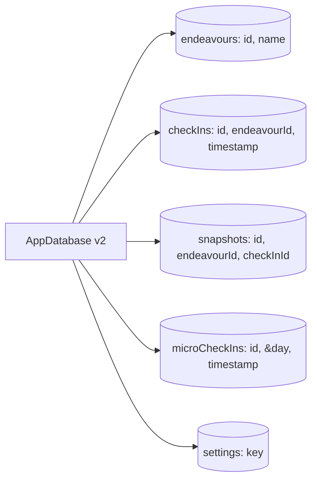

# `src/data` — Persistence

The **local persistence layer** of Rival: the Dexie/IndexedDB schema, the repositories that wrap it, and the small set of live-query hooks the UI reads through. It is the boundary between pure domain knowledge and durable state.

> **One-sentence purpose:** _Persist and retrieve every domain entity through a
> thin, typed repository over Dexie — the only layer that touches IndexedDB._

```
   dependency direction (low → high)
   ┌────────────────────────────┐
   │ domain/models              │  (entity contracts: Snapshot, CheckIn,
   │                            │   Endeavour, DomainSegment)
   ├────────────────────────────┤
   │ data/schema                │  (Dexie table row shapes)
   ├────────────────────────────┤
   │ data/db                     │  (the Dexie database + versioning)
   ├────────────────────────────┤
   │ data/repositories           │  (typed data access)
   └─────────▲──────────────────┘
             │ consumed by viewmodels + shells
```

---

## File-by-file map

| Path                                     | Responsibility                                                                            | Public surface                                              |
| ---------------------------------------- | ----------------------------------------------------------------------------------------- | ----------------------------------------------------------- |
| `db.ts`                                  | The Dexie `AppDatabase` + table versioning                                                | `AppDatabase`, `db` (singleton)                             |
| `schema/EndeavourRow.ts`                 | `EndeavourRow` persistence/export DTO + domain↭row mapping                                | `EndeavourRow`, `endeavourToRow`, `rowToEndeavour`          |
| `schema/CheckInRow.ts`                   | `CheckInRow` persistence/export DTO + domain↭row mapping                                  | `CheckInRow`, `checkInToRow`, `rowToCheckIn`                |
| `schema/SnapshotRow.ts`                  | `SnapshotRow` persistence/export DTO + domain↭row mapping                                 | `SnapshotRow`, `snapshotToRow`, `rowToSnapshot`             |
| `schema/MicroCheckIn.ts`                 | daily non-GIS mood **rows**; `MicroMood` vocabulary lives in `domain/models/MicroMood.ts` | `MicroCheckIn`                                              |
| `schema/AppSettings.ts`                  | settings key-value rows + `SyncStatus`                                                    | `AppSettings`, `SettingsRow`, `SyncStatus`, `SYNC_STATUSES` |
| `repositories/EndeavourRepository.ts`    | endeavour CRUD + domain switching + lifecycle, **returns `Result`**                       | `EndeavourRepository`, `EndeavourWithLatestSnapshot`        |
| `repositories/CheckInRepository.ts`      | check-in + snapshot creation, **returns `Result`**                                        | `CheckInRepository`                                         |
| `repositories/SnapshotRepository.ts`     | snapshot queries (latest per endeavour / segment), **returns `Result`**                   | `SnapshotRepository`                                        |
| `repositories/MicroCheckInRepository.ts` | daily mood reads/writes, **returns `Result`**                                             | `MicroCheckInRepository`                                    |
| `repositories/SettingsRepository.ts`     | settings get/set, **returns `Result`**                                                    | `SettingsRepository`                                        |

---

## The storage layout



`db.ts` owns the schema + versioning. Each table's row shape is a dedicated
DTO in `schema/` (e.g. `EndeavourRow`, `CheckInRow`, `SnapshotRow`), typed
independently of the pure `domain` models. Repositories accept and return
`domain` values and map them to/from those row DTOs at this boundary, so a
storage or export-format change stays inside `data/` (see `domain↭row`
mappers in each `*Row.ts`).

### Schema migrations

Every schema change appends one `version(N)` to the Dexie chain (older blocks
are untouched). Each transition ships with a dedicated test; a destructive
change is a new link, never an edit to an old `version()` block. Rollback is
not in place — a failed upgrade rejects open, which is why a full
`rival-backup.json` export remains the recovery story. See
`data/migrations/migrationPolicy.ts` for the step-by-step rule.

## The repository contract

Every repository returns `Result` for _expected_ failures (storage quota /
corruption) instead of throwing — this is the **standard contract across all five
repositories**, not just check-in. A Dexie error is classified once, in the
repository, via `ErrorClassifier.fromDexieError`.

```ts
// CheckInRepository — the Result-returning, row-mapped pattern
async record(checkIn: CheckIn, snapshot: Snapshot): Promise<Result<void>> {
  try {
    await db.transaction("rw", db.checkIns, db.snapshots, async () => {
      await db.checkIns.add(checkInToRow(checkIn));
      const created = await snapshots.create(snapshot);
      if (!created.ok) return Err(created.error);
    });
    crossTabBus.post("app:data-changed", { changedAt: Date.now() });
    return Ok(undefined);
  } catch (e) {
    return Err(ErrorClassifier.fromDexieError(e, { entity: "CheckIn" }));
  }
}
```

The public repo surface speaks `domain` values; the row DTOs (`*Row`) are only crossed at the physical table edges via the `*ToRow`/`rowTo*` mappers.

Read-heavy screens may use `useLiveQuery` for reactive rendering, but the query callback must call a data-owned repository/query handle rather than accessing `db` directly. Writes go through repositories and are surfaced by `useAsync` / `reportError` at the viewmodel layer. Successful committed writes publish `app:data-changed` through the runtime cross-tab bus.

`MicroCheckIn` stores a canonical `day` key and the v2 schema makes it unique, so the once-per-calendar-day rule is enforced by IndexedDB rather than a race-prone read-then-insert sequence.

---

## Cross-package connections (one level deeper)

### Inbound — what `data` imports

- `@/domain/models` — the entity contracts (`Snapshot`, `CheckIn`, `Endeavour`, `DomainSegment`, `GisTier`) + `ConsistencyStatus` — schema typing
- `@/domain/errors` — `Ok`/`Err`/`Result`/`ErrorClassifier` (repository error contract)
- `@/core/logging` — logging
- `dexie`, `dexie-react-hooks`

### Outbound — who consumes `data`

| Consumer             | What it uses                                                                                                              |
| -------------------- | ------------------------------------------------------------------------------------------------------------------------- |
| `src/viewmodels`     | `checkInRepository.record`, `endeavourRepository.*`, `snapshotRepository.*`, `settingsRepository.*`, `useLiveQuery` hooks |
| `src/sync`           | `db` + `dataExport`/`dataImport` (via `exportAllData`/`importAllData`)                                                    |
| `src/shells/runtime` | — (reads via viewmodels)                                                                                                  |

---

## Testing

Each repository has a sibling `.test.ts` using `fake-indexeddb` (via `src/test/setup.ts`) so the in-memory IndexedDB is exercised without a browser.

```bash
npx vitest run --config vite.config.ts src/data
```

