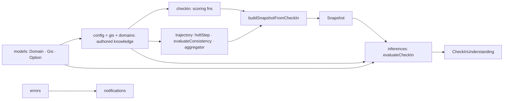

# `src/domain` — Pure Product Knowledge

The **pure, UI-agnostic brain** of Rival. Everything that is true about the product — what an endeavour is, how a check-in is scored, how a trajectory is read, which GIS/domains exist, how a session is reasoned about, and how errors and feedback are modeled — lives here. Nothing in `domain` imports React, the DOM, or the browser.

> **One-sentence purpose:** _The single source of truth for what Rival *knows* and how it *thinks* — deterministic, pure, and reusable by any UI._

```
   dependency direction (low → high)
   ┌──────────────────────────────────────────────────────────┐
   │ src/domain/models · config · gis · domains  (leaf "data") │
   └─────────────▲────────────────────────────────────────────┘
                 │
   ┌─────────────┴───────────┐   ┌────────────────────┐
   │ checkin · trajectory     │   │ inferences          │
   │ (math engines)           │   │ (session reasoning) │
   └─────────────▲───────────┘   └─────────▲──────────┘
                 │                         │
   ┌─────────────┴─────────────────────────┴─────────┐
   │ errors · notifications  (the feedback vocabulary) │
   └─────────────▲────────────────────────────────────┘
                 │  consumed by
   ┌─────────────┴─────────────────────────────────────┐
   │ core/runtime · data · sync · auth · shells · vm    │
   └───────────────────────────────────────────────────┘
```

---

## Sub-package map

| Sub-package      | Responsibility                                                                                                                                                                                                                                                                                                  | Key files                                                                                              |
| ---------------- | --------------------------------------------------------------------------------------------------------------------------------------------------------------------------------------------------------------------------------------------------------------------------------------------------------------- | ------------------------------------------------------------------------------------------------------ |
| `models/`        | The base entity contracts — `Domain`, `Gis`, `Option`, `GisTier`, `QuestionType`, plus the aggregate value objects `CheckIn`, `Snapshot`, `Endeavour`, `DomainSegment` (with `activeSegment`) and leaf value vocab (e.g. `MicroMood`); persistence maps them to `data/schema/*Row` DTOs at the storage boundary | `Domain.ts`, `Gis.ts`, `CheckIn.ts`, `Snapshot.ts`, `Endeavour.ts`, `MicroMood.ts`                     |
| `config/`        | **One place** for every math/behavior threshold + the calc-provenance version labels                                                                                                                                                                                                                            | `tuningConstants.ts`, `versions.ts`                                                                    | `tuningConstants.ts` |
| `gis/`           | The authored Growth Indicative Strategies (questions per GIS)                                                                                                                                                                                                                                                   | `gisDefinitions.ts`                                                                                    |
| `domains/`       | The authored Domain definitions + their GIS map                                                                                                                                                                                                                                                                 | `domainDefinitions.ts`                                                                                 |
| `checkin/`       | Turns a completed check-in into a persisted `Snapshot` (scoring) + the raw-score invariant                                                                                                                                                                                                                      | `CheckInProcessor.ts`, `checkInScoringEngine.ts`, `rawScore.ts`                                        |
| `trajectory/`    | Smoothes scores over time + reads a direction label                                                                                                                                                                                                                                                             | `holtSmoother.ts`, `consistencyTracker.ts`, `trajectoryAggregator.ts`                                  |
| `inferences/`    | The check-in reasoning engine — `evaluateCheckIn`                                                                                                                                                                                                                                                               | `orchestrator.ts`, `engine.ts`, `ruleDefinitions.ts`, `conditionEvaluator.ts`, `presentationPolicy.ts` |
| `errors/`        | Error taxonomy, `Result`, classification, retry, reporter                                                                                                                                                                                                                                                       | `AppError.ts`, `Result.ts`, `ErrorClassifier.ts`, `withRetry.ts`, `reporter.ts`                        |
| `notifications/` | The message lifecycle — store, bridge, arbitration, typed action builders                                                                                                                                                                                                                                       | `types.ts`, `store.ts`, `client.ts`, `arbitration.ts`, `actions/`                                      |

---

## How the domain fits together

The sub-packages form a clear build-up from **leaf data → math → reasoning → feedback vocabulary**.



- **`models`** are the primitive contracts everything else types against.
- **`config` + `gis` + `domains`** are the _authored_ single-sources-of-truth: all GIS questions, all domain definitions, and every tuning constant.
- **`checkin` + `trajectory`** are the _math_: score a check-in, smooth the trend, label the direction. They read `models` + `config`.
- **`inferences`** is the _reasoning_: it folds the same context into a ranked, explained `CheckInUnderstanding` (see its own `ARCHITECTURE.md`).
- **`errors` + `notifications`** are the _feedback vocabulary_: how a failure is classified (errors) and how any message is shown (notifications). They are the leaf the runtime framework depends on (see their `ARCHITECTURE.md`s).

---

## Cross-package connections (one level deeper)

### Inbound — what `domain` imports

`domain` imports only from within itself and, at the `errors`/`notifications` boundary, from `@/core/logging` (the logger) and `@/design-system/icons` (for `IconName` on `Option`). It never imports React, `data`, or `shells`.

### Outbound — who consumes `domain`

| Consumer             | What it uses                                                                                                            |
| -------------------- | ----------------------------------------------------------------------------------------------------------------------- |
| `src/data`           | entity contracts (`Snapshot`, `CheckIn`, `Endeavour`, `DomainSegment`) from `domain/models`; repos call `domain/errors` |
| `src/viewmodels`     | `domain/checkin` (buildSnapshotFromCheckIn, scoring fns), `domain/inferences` (evaluateCheckIn), `domain/config`        |
| `src/core/runtime`   | `domain/notifications` + `domain/errors` (bridge, classification, withRetry)                                            |
| `src/sync`           | `domain/errors` (classify Drive errors)                                                                                 |
| `src/shells/runtime` | `domain/errors` + `domain/notifications` (reportError, bridge)                                                          |
| `src/components`     | `domain/models` (`GisTier`) + `design-system/icons`                                                                     |

Each sub-package that has real internal structure has its own `ARCHITECTURE.md`: `inferences/`, `errors/`, `notifications/`.

---

## Testing

Tests live beside their code: `checkin/*.test.ts`, `trajectory/*.test.ts`, `inferences/*.test.ts`, `errors/errorLayer.test.ts`, `notifications/arbitration.test.ts`.

Run them together:

```bash
npx vitest run --config vite.config.ts src/domain
```

