# `src/domain/errors` — Error Taxonomy, Result, Classification

The **vocabulary and funnel** for every expected failure in Rival: what an error _is_, how a `Result` carries it, how a raw vendor exception becomes one, how a system-initiated op retries, and the single funnel (`reportError`) that decides whether and how a failure reaches the user.

> **One-sentence purpose:** _Expected failures are values, not exceptions — every error is classified into a closed `AppError`, returned as a `Result`, and routed through one funnel so the app surfaces it consistently._

**This package is pure** — zero React, zero browser APIs, zero design-system. It is one of the four homes of the runtime feedback framework:

```
   dependency direction (low → high)
   ┌───────────────────────┐
   │ domain/notifications  │  (message lifecycle — the display vocabulary)
   └──────────▲────────────┘
              │ depends on types only
   ┌──────────┴────────────┐
   │ domain/errors         │  ◄── this package
   └──────────▲────────────┘
              │ consumed by
   ┌──────────┴────────────┐   ┌──────────────┐   ┌─────────────────┐
   │core/runtime (monitors)│   │ data / auth  │   │ shells/runtime   │
   │                       │   │ sync / view  │   │ (React)          │
   └───────────────────────┘   └──────────────┘   └─────────────────┘
```

---

## The two-axis model

Every error in Rival travels along **two independent axes** that are decided at _different times_:

1. **Classification** (decided by `ErrorClassifier` at the throw site): _what kind_ of error is this, _how urgent_ (tone), _is it retryable_.
2. **Presentation** (decided by `reporter` at the funnel): _does it surface at all_, and if so, as a toast / banner / blocking modal, with what action.

The separation matters: the same `AppError` kind can present differently depending on _where_ it happened (a `validation` error is a toast app-wide, but a form field renders its own inline copy). Classification is stable; presentation is contextual.

---

## File-by-file map

| File                 | Responsibility                                                                                 | Public surface                                                                                               |
| -------------------- | ---------------------------------------------------------------------------------------------- | ------------------------------------------------------------------------------------------------------------ |
| `AppError.ts`        | The closed error taxonomy — `ErrorKind`, `ErrorTone`, `ErrorSurface`, `AppError`, `isAppError` | `ErrorKind`, `ErrorTone`, `ErrorSurface`, `AppError`, `isAppError()`                                         |
| `Result.ts`          | The load-bearing return type — expected failures are values, not throws                        | `Ok()`, `Err()`, `unwrap()`, `mapResult()`, `Result<T,E>`                                                    |
| `ErrorClassifier.ts` | The _only_ place that inspects vendor error shapes (`Dexie name`, `Drive status`)              | `ErrorClassifier.fromDexieError()`, `.fromDriveApiError()`, `.validation()`, `.notFound()`, `.fromUnknown()` |
| `withRetry.ts`       | Silent exponential backoff for system-initiated ops, racing against reconnection               | `withRetry()`, `wakeRetryQueue()`, `isOffline()`                                                             |
| `reporter.ts`        | The single error funnel — `AppError` → `RuntimeInterest`, noise-filtered, logged               | `reportError()`, `notifyDirect()`, `setReporter()`                                                           |

---

## The flow — from throw to funnel

```mermaid
flowchart LR
    A[Raw vendor exception<br/>Dexie / Drive / fetch] --> B[ErrorClassifier]
    B --> C[AppError]
    C --> D{reportError?}
    D -->|repo returns Result<br/>Err&#40;appError&#41;| E[caller / useAsync]
    D -->|raw throw| F[ErrorClassifier.fromUnknown]
    F --> C
    E --> G[reporter.reportError]
    G --> H{noise?}
    H -->|yes| I[log only]
    H -->|no| J[map to RuntimeInterest]
    J --> K[raise on notification bridge]
    K --> L[store → React renders]
```



### Layer by layer

**`Result<T, E = AppError>`** is the contract every data/service method returns for an _expected_ failure. It encodes the design rule: _expected failures are values you return; unexpected failures (bugs) still throw and hit the error boundary._ A method that throws for something that happens in normal operation should have been classified and returned as a `Result`.

```ts
async get(id: string): Promise<Result<Endeavour>> {
  try {
    const row = await this.db.endeavours.get(id);
    if (!row) return Err(ErrorClassifier.notFound("Endeavour", id));
    return Ok(row);
  } catch (e) {
    return Err(ErrorClassifier.fromDexieError(e, { id })); // quota → storage-quota, DataError → storage-corrupt
  }
}
```

**`ErrorClassifier`** is the single choke-point that turns vendor-specific shapes into the closed `AppError` vocabulary. A new data source later means one new static method here — nowhere else. It checks `navigator.onLine` **first** on every network-touching path, because an offline device is always the real cause regardless of what the vendor error says.

**`withRetry`** is split by _origin of the failure_, not by error kind:

- **System-initiated** (background sync, token refresh) → `withRetry()` retries silently with exponential backoff. It **races against reconnection**: the connectivity monitor calls `wakeRetryQueue()` on `online`, so a pending backoff fires immediately instead of sitting out its delay.
- **User-initiated** (submitting a check-in) → **no auto-retry**; the failure surfaces with a manual Retry action wired via `reportError`'s `retry` param.

**`reporter.reportError`** is the single funnel every error passes through — whichever origin: a classified `AppError` from a repo's `Result`, a manual catch anywhere, a render crash, or a window-level uncaught throw/rejection. It:

1. Classifies unknowns (`isAppError(input) ? input : ErrorClassifier.fromUnknown`).
2. Filters known-noise (`IGNORED_PATTERNS` — `ResizeObserver loop`, non-Error rejections) → logs only, never surfaces.
3. Logs via `Logger`.
4. Maps the `AppError` → a `RuntimeInterest` — **copying `tone` and `surface` straight through** (no re-derivation, no split): `tone` stays as-is, `surface` is one closed `MessageSurface` union (the `silent` branch already returned above), carrying the classified `errorKind`, plus a wired Retry action when `retryable && retry`.
5. Raises it on the notification bridge (set by `setReporter`).

---

## Cross-package connections (one level deeper)

### Inbound — what `domain/errors` imports

| Package                                      | Symbol(s)                          | Why                                                                                                                                                                         |
| -------------------------------------------- | ---------------------------------- | --------------------------------------------------------------------------------------------------------------------------------------------------------------------------- |
| `@/domain/notifications/types`               | `MessageSurface`, `RuntimeMessage` | `AppError.surface` is a `MessageSurface` (+ log-only `silent`); `reporter` maps into a `RuntimeInterest` shape and leaves runtime-specific action policy to the coordinator |
| `@/domain/notifications/client`              | `Bridge`                           | the live target `reporter` pushes surfaced errors onto                                                                                                                      |
| `@/domain/notifications/actions/retryAction` | `createRetryAction`                | `reporter` wraps a retryable failure as a Retry CTA                                                                                                                         |
| `@/core/logging/logger`                      | `Logger`                           | the app-wide logging sink                                                                                                                                                   |

### Outbound — who consumes `domain/errors`

| Consumer package/file                        | What it uses                             | When                                                        |
| -------------------------------------------- | ---------------------------------------- | ----------------------------------------------------------- |
| `src/data/repositories/CheckInRepository.ts` | `Ok`, `Err`, `Result`, `ErrorClassifier` | every repo method returns `Result`; Dexie errors classified |
| `src/viewmodels/useCheckInViewModel.ts`      | `reportError`                            | check-in record failure surfaced through the funnel         |
| `src/sync/syncService.ts`                    | `reportError`, `notifyDirect`            | Drive sync/restore failures + success toasts                |
| `src/core/runtime/coordinator.ts`            | `withRetry`, `wakeRetryQueue`            | wakes retry queue on reconnect                              |
| `src/shells/runtime/*` (React)               | `reportError`, `setReporter`             | error boundary + global capture + provider wiring           |

---

## Testing

`src/domain/errors/errorLayer.test.ts` covers:

- `ErrorClassifier` — Dexie name mapping (`storage-quota`, `storage-corrupt`), Drive status mapping (`auth-expired`, `sync-conflict`, retryable `network`), and **offline-FIRST** (a 429 reported as `offline` when `navigator.onLine` is false).
- `Result` — `Ok`/`Err`/`unwrap`/`mapResult`.
- `withRetry` — retries a retryable failure up to `maxAttempts`, does not retry a non-retryable one, and `wakeRetryQueue()` resolves a pending backoff early (the reconnect race).

```bash
npx vitest run --config vite.config.ts src/domain/errors
```
