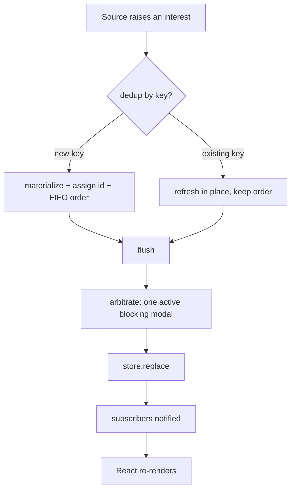

# `src/domain/notifications` — The Message Lifecycle

The **pure state machine + signal bus** at the heart of the runtime feedback framework: the vocabulary of what a message is, the reactive store, and the bridge that turns "raise an interest" into "show a message" with dedup, once/re-arm semantics, and **blocking arbitration** (exactly one modal at a time).

> **One-sentence purpose:** _One vocabulary, one store, one bridge — so that at any instant Rival shows at most one thing the user must deal with, deduped and prioritized, and everything else waits its turn._

**This package is the standalone leaf** of the framework — it imports nothing from the other framework packages. Everything else depends on it.

```
   dependency direction (low → high)
   ┌───────────────────────────┐
   │ domain/notifications       │  ◄── this package (leaf, no inbound deps)
   └───────────▲───────────────┘
               │
   ┌───────────┴───────────────┐   ┌────────────────┐
   │ domain/errors              │   │ core/runtime   │
   │ (maps into our interest)   │   │ (raises via us)│
   └───────────▲───────────────┘   └────────────────┘
               │
   ┌───────────┴───────────────┐
   │ shells/runtime (React)     │  ← subscribes to the store, renders
   └───────────────────────────┘
```

---

## The message model

A **`RuntimeMessage`** is the immutable unit of feedback. Every source — a monitor, a service, a service worker — ultimately produces one. Its `tone` and `surface` come with it (never mapped in the renderer); the **blocking branch** of `surface` drives arbitration (`isBlockingSurface` / `blockingRank`).

```mermaid
flowchart LR
    subgraph Vocabulary
        T[MessageTone<br/>info · warning · error]
        S[MessageSurface<br/>toast · banner · blocking{priority}]
        A[RuntimeAction<br/>kind + presentationKind + run]
    end
    T --> M[RuntimeMessage]
    S --> M
    A --> M
```

**`RuntimeMessage`** = `{ id, tone, surface, title, body?, once?, action?, busy? }`

Presentation is one axis (`surface`) plus a pure color (`tone`):

- **`tone`** sets the color and flows straight from the source (the error classifier) — the renderer never re-derives it from a reason label.
- **`surface`** is a single closed union: a passive `toast`, a passive `banner`, or the one arbitrated **blocking** modal (ranked by `priority`). There is no "not-blocking-but-unspecified" in-between. `isBlockingSurface`/`blockingRank` surface the arbitration hooks.

`once` says "show this modal once, then never re-raise until re-armed" (so an expired-session dialog doesn't recur every render).

---

## File-by-file map

| File             | Responsibility                                                                                                                                                                                                         | Public surface                                                 |
| ---------------- | ---------------------------------------------------------------------------------------------------------------------------------------------------------------------------------------------------------------------- | -------------------------------------------------------------- |
| `types.ts`       | The entire vocabulary — `MessageTone`, `MessageSurface`, `BlockingPriority`, `BLOCKING_PRIORITY`, `isBlockingSurface`, `blockingRank`, `Blockable`, `ActionKind`, `RuntimeAction`, `RuntimeMessage`, `RuntimeInterest` | all of the above                                               |
| `store.ts`       | A tiny pub/sub snapshot holder; immutable `replace` + notify. Factory-over-class                                                                                                                                       | `createRuntimeStore()`, `RuntimeStore`, `RuntimeStoreSnapshot` |
| `client.ts`      | The **bridge** — dedup by key, once/re-arm, and paths each raise through arbitration                                                                                                                                   | `createBridge()`, `Bridge`                                     |
| `arbitration.ts` | The blocking policy — pick the single active modal                                                                                                                                                                     | `arbitrate()`, `compareBlocking()`                             |
| `actions/`       | Typed action builders — one tight factory per action kind; `RuntimeAction.kind` is the closed `ActionKind` union, so producers can't emit stray action literals                                                        | each `createXAction()`                                         |

---

## The core loop — `store` + `bridge` + `arbitration`



### Three decisions, each owned exactly once

1. **Dedup** — `client.ts` keys every message by its `key`. Raising the same `key` again _refreshes the existing message_ rather than stacking a duplicate. This is what keeps "you're offline" a single banner that updates, not a pile.

2. **Once / re-arm** — a `once` message, once dismissed, is added to a `spent` set and suppressed until `reArm(key)`. `raise` short-circuits spent keys, so a once-blocking modal can't re-fire on the next render.

3. **Arbitration** — `arbitrate()` picks the single active blocker from all blocking candidates: **highest priority, earliest-raised on ties**, and it _preempts_ a currently-shown lower-priority one (corruption outranks auth the moment it arrives). Every non-winning message stays a passive notice, queued behind it. This is the exact fix for the "two blocking modals, no rule" gap.

```ts
// arbitration.ts — the whole policy in a few lines
const active = arbitrate(blockingCandidates(messages));
const blocking = active ? (messages.find((m) => m.id === active.id) ?? null) : null;
const notices = messages.filter((m) => (isBlockingSurface(m.surface) ? m.id === activeId : true));
store.replace({ blocking, notices });
```

The store is deliberately dumb — it stores **exactly** the `{ blocking, notices }` it's told. All judgment (dedup, once, arbitration) lives in the bridge so the store stays a pure, testable snapshot holder.

---

## Cross-package connections (one level deeper)

### Inbound — what `domain/notifications` imports

**Nothing from the other framework packages.** It is the standalone leaf. This is deliberate and load-bearing: the vocabulary and lifecycle have no concept of "errors," "connectivity," or "React." Those all depend _on_ it.

### Outbound — who consumes `domain/notifications`

| Consumer                                   | What it uses                                                                 | When                                                                                                                                                             |
| ------------------------------------------ | ---------------------------------------------------------------------------- | ---------------------------------------------------------------------------------------------------------------------------------------------------------------- |
| `@/domain/errors` (`AppError`, `reporter`) | `MessageSurface`, `RuntimeMessage`, `Bridge`, `RuntimeInterest`              | `AppError.surface` is a `MessageSurface` (+ log-only `silent`); `reporter` copies `tone` + `surface` straight through and raises surfaced errors onto the bridge |
| `@/core/runtime/coordinator`               | `createBridge`, `createRuntimeStore`, `RuntimeInterest`, `BLOCKING_PRIORITY` | `createRuntime` builds the bridge + store and raises monitor-driven interests                                                                                    |
| `@/core/runtime/react`→`shells/runtime`    | `createRuntimeStore`, `RuntimeStoreSnapshot`                                 | the React provider subscribes and re-renders                                                                                                                     |

### Runtime interest factory

Both the coordinator (monitor-driven) and `reporter` (error-driven) build `RuntimeInterest` objects. They share the **type** — the coordinator uses a small local `interest()` builder, the reporter builds its own shape inline. Both set `tone` + `surface` at the source; each `surface` is the same closed `MessageSurface` union, so no producer ever re-maps a reason or splits surface across fields. Single ownership of the _type_ is in `types.ts` (beside its output twin `RuntimeMessage`); the two producers stay separate because they express different concerns against the same contract.

---

## Testing

`src/domain/notifications/arbitration.test.ts` covers:

- `compareBlocking` ordering — `corruption > auth > other`.
- `arbitrate` — a higher-priority blocker **preempts** a currently-lower one; picks the highest priority when none active; breaks priority ties by insertion order; returns `null` when nothing blocks.
- `bridge` — dedups by key (repeat raise updates, not stacks); holds at most one blocking message (highest priority wins); `once` messages don't re-raise after dismiss until `reArm`.

```bash
npx vitest run --config vite.config.ts src/domain/notifications
```
