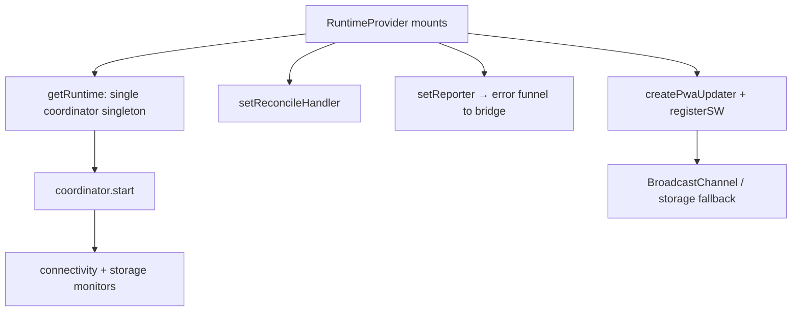

# `src/shells/runtime` — The React Bindings

The **app-shell UI layer** of the runtime feedback framework: everything that makes the pure framework render. It mounts the coordinator's single runtime, subscribes React to its store, draws the current snapshot (snapshot hooks + renderers) with the design system's own primitives, and provides the error boundary, page loader, and global capture that wire the framework into the app. The store + runtime themselves stay in `core/runtime` (never created here).

> **One-sentence purpose:** _Subscribe React to the coordinator's one runtime and draw its message state using the design system's own components — never re-implementing message logic, visuals, or a second store/runtime that already exist below._

**This is the apex of the framework** — it depends on all three lower packages and on React + `@/components`. It owns no message state and no error logic; it only _reads_ the store and _renders_.

```
   dependency direction (low → high)
   ┌───────────────────────────┐
   │ domain/notifications      │
   └───────────▲───────────────┘
               │
   ┌───────────┴───────────────┐   ┌────────────────┐
   │ domain/errors             │   │ core/runtime   │
   └───────────▲───────────────┘   └────────────────┘
               │                        │
   ┌───────────┴────────────────────────┴──────────┐
   │ shells/runtime (React)                        │  ◄── this package
   │  RuntimeProvider · renderers · hooks ·        │
   │  ErrorBoundary · PageLoader · global capture  │
   └───────────────────────────────────────────────┘
```

---

## File-by-file map

| File                        | Responsibility                                                                                                                                                       | Public surface                                               |
| --------------------------- | -------------------------------------------------------------------------------------------------------------------------------------------------------------------- | ------------------------------------------------------------ |
| `react.tsx`                 | React-boot wiring only: starts the coordinator singleton's monitors, attaches the reporter + PWA updater, draws via `useSyncExternalStore`; owns no store or runtime | `RuntimeProvider`, `useRuntimeSnapshot`, `useDismissMessage` |
| `renderers.tsx`             | Draw the store — banners, toasts, the blocking modal — over existing components                                                                                      | `RuntimeNotices`, `RuntimeToasts`, `RuntimeBlockingDialog`   |
| `RuntimeNotices.module.css` | The top-stack layout for persistent banners                                                                                                                          | (CSS module)                                                 |
| `useAsync.ts`               | Local `idle/loading/success/error` status for `Result`-returning calls                                                                                               | `useAsync`                                                   |
| `ErrorBoundary.tsx`         | Render-crash net → same `reportError` funnel                                                                                                                         | `ErrorBoundary`                                              |
| `PageLoader.tsx`            | Counter-based full-page blocking loader                                                                                                                              | `PageLoaderProvider`, `usePageLoader`                        |
| `bootstrapErrorCapture.ts`  | `window.onerror` / `unhandledrejection` → `reportError`                                                                                                              | `installGlobalErrorCapture`                                  |

---

## The provider — owning the singleton

The live runtime lives in `coordinator.getRuntime()` — the single store + monitors that auth/sync and services raise through. `RuntimeProvider` does not build it; on mount it performs only the React-boot wiring against that already-existing instance:

1. Starts the coordinator (`runtime.start()`) — mounts the connectivity + storage monitors.
2. Routes the error funnel to the bridge (`setReporter`).
3. Wires the real PWA update lifecycle (`createPwaUpdater` + `registerSW`).



Because there is exactly one store + runtime, services firing before first paint and React subscribing later talk to the same instance. `start()` re-arms its monitor subscriptions on each mount and `stop()` tears them down, so StrictMode remounts never stack duplicate monitors. Drawing (banners/toasts/modal) and dismissal read the same runtime through `useRuntimeSnapshot` / `useDismissMessage` — no context indirection.

---

## The renderers — thin, stateless, design-system-first

The three renderers are deliberately dumb. They read `useRuntimeSnapshot()`, separate the store into toasts vs. banners, and hand each message to an existing component. **They never re-implement toast timing, modal styling, or layout that the design system already provides.**

| Renderer                | Reads                         | Renders with                        | Auto-dismiss                      |
| ----------------------- | ----------------------------- | ----------------------------------- | --------------------------------- |
| `RuntimeNotices`        | non-`toast` notices           | existing `Alert` (top stack)        | manual (user dismiss / `dismiss`) |
| `RuntimeToasts`         | `toast` notices               | existing `Toast` / `ToastContainer` | **owned by `Toast`** (4000ms)     |
| `RuntimeBlockingDialog` | the single `blocking` message | existing `Dialog`                   | manual (dismiss/action)           |

```tsx
// RuntimeToasts — the existing Toast owns its own timer + close animation
<ToastContainer>
  {toasts.map((msg) => (
    <Toast id={msg.id} variant={toneFor(msg)} message={msg.body ?? msg.title} onClose={dismiss} />
  ))}
</ToastContainer>
```

The `onClose` calls back into the bridge (`dismiss`), so removal is the single responsibility of the message lifecycle — the renderer only displays.

---

## The rest — hooks, boundary, loader, capture

- **`useAsync`** — a `Result`-returning call's local status machine. On failure it funnels to `reportError` (default) with its own `run` wired as the Retry callback, so a retryable error's Retry action re-fires the exact call. This is the standard way a screen consumes a repo's `Result`.
- **`ErrorBoundary`** — catches render-crashing bugs and sends them through the _same_ `reportError` pipeline, so a crash is surfaced consistently (not its own path). If it fires often, something should've been a `Result`.
- **`PageLoader`** — a counter-based (`Map` of tokens) full-page loader. Two overlapping loads don't hide each other early. Deliberately narrow: button spinners and inline skeletons stay local component state.
- **`installGlobalErrorCapture`** — catches everything that slips past the other nets (`window.onerror`, `unhandledrejection`), routed through `reportError`.

---

## Cross-package connections (one level deeper)

### Inbound — what `shells/runtime` imports

| Package                                       | Symbol(s)                                                    | Why                                                    |
| --------------------------------------------- | ------------------------------------------------------------ | ------------------------------------------------------ |
| `@/domain/notifications/store`                | `createRuntimeStore`, `RuntimeStore`, `RuntimeStoreSnapshot` | the store the provider subscribes to                   |
| `@/domain/notifications/types`                | `RuntimeMessage`                                             | provider + renderer prop/state typing                  |
| `@/domain/notifications/actions/reloadAction` | `createReloadAction`                                         | the PWA-update banner's Reload CTA                     |
| `@/core/runtime/connectivity`                 | `ConnectivityEnv`                                            | runtime browser-env contract                           |
| `@/core/runtime/storage`                      | `StorageProvider`                                            | runtime browser-env contract                           |
| `@/core/runtime/coordinator`                  | `getRuntime`, `Runtime`                                      | the single store + runtime this shell mounts and draws |
| `@/core/runtime/pwa`                          | `createPwaUpdater`                                           | cross-tab PWA update broadcast                         |
| `@/core/runtime/crossTab`                     | `crossTabBus`                                                | bus handed to the PWA updater                          |
| `@/domain/errors/reporter`                    | `setReporter`                                                | routes the error funnel to the live bridge             |
| `@/domain/errors/*`                           | `reportError`, `Result`, `AppError`                          | useAsync, boundary, capture                            |
| `virtual:pwa-register`                        | `registerSW`                                                 | real SW update lifecycle (via `vite-env.d.ts`)         |
| `@/components/{alert,toast,dialog,button}`    | the primitives                                               | renderers use the design system                        |

### Outbound — how the app consumes `shells/runtime`

| Consumer                           | What it uses                                                                          | When                                      |
| ---------------------------------- | ------------------------------------------------------------------------------------- | ----------------------------------------- |
| `src/main.tsx`                     | `RuntimeProvider`, `ErrorBoundary`, `PageLoaderProvider`, `installGlobalErrorCapture` | app boot — wrap the tree, install capture |
| `src/shells/AppShell/AppShell.tsx` | `RuntimeNotices`, `RuntimeToasts`, `RuntimeBlockingDialog`                            | render the app-wide feedback surfaces     |

```tsx
// main.tsx
<ErrorBoundary fallback={...}>
  <PageLoaderProvider>
    <ThemeProvider>
      <RuntimeProvider>
        <App />
      </RuntimeProvider>
    </ThemeProvider>
  </PageLoaderProvider>
</ErrorBoundary>
```

```tsx
// AppShell
<RuntimeNotices />
<RuntimeToasts />
<RuntimeBlockingDialog />
```

---

## Testing

The React layer has no dedicated test file (the logic it delegates to — store, bridge, arbitration, connectivity, cross-tab, classifier, withRetry — is covered in the three lower packages' suites). Its correctness is enforced structurally: **it owns no message/error logic**, so unit coverage of the pure layer fully exercises what renders here.

```bash
npx vitest run --config vite.config.ts src/domain/notifications src/domain/errors src/core/runtime
```

