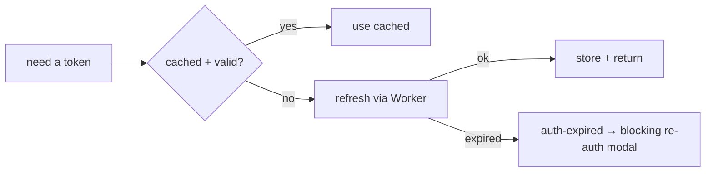

# `src/sync` — Drive Backup & Sync

The **Drive backup/sync layer** of Rival: OAuth token lifecycle, the Drive REST client, full export/import of the local store, and the high-level `SyncService` that ties them together for the UI.

> **One-sentence purpose:** _Persist a full backup to Google Drive and restore
> from it — with a resilient token lifecycle, transparent retry, and framework
> feedback wired in._

```
   dependency direction (low → high)
   ┌──────────────────────────────────┐
   │ sync/driveSync                   │  (Drive REST read/write, with retry)
   ├──────────────────────────────────┤
   │ sync/dataExport · dataImport     │  (full-store JSON export/import + validation)
   ├──────────────────────────────────┤
   │ sync/pendingSync · backgroundSync│  (durable latch + cross-tab background pump)
   ├──────────────────────────────────┤
   │ sync/syncService                 │  (the orchestration the UI calls)
   └─────────▲────────────────────────┘
             │ consumed by viewmodels + screens
```

---

## File-by-file map

| File             | Responsibility                                                                                                                               | Public surface                                                                                    |
| ---------------- | -------------------------------------------------------------------------------------------------------------------------------------------- | ------------------------------------------------------------------------------------------------- |
| `driveSync.ts`   | Drive REST helpers — find/upload/download `rival-backup.json` with layered retry (401 / 429 / 5xx), plus deterministic duplicate convergence | `exportToDrive()`, `importFromDrive()` |
| `dataExport.ts`  | Reads the whole store into a typed, portable `DataExport` JSON                                                                               | `exportAllData()`, `DataExport`, `downloadAsJson()`                                               |
| `dataImport.ts`  | Validates and applies a `DataExport` to the local store (`replace` / `merge`), with settings policy and safety-wrapped restore               | `importAllData()`, `restoreAllData()`, `isDataExport()`, `ImportStrategy`, `ImportSummary`        |
| `pendingSync.ts` | Durable whole-snapshot pending latch + sync diagnostics (attempts, last failure _kind_, last success) without tokens/PII                     | `createPendingSyncStore()`, `pendingSyncStore`, `SyncDiagnostics`                                 |
| `driveDedup.ts`  | Deterministic single-backup rule (keep earliest-created, trash the rest; stable on `createdTime`)                                            | `pickAuthoritative()`, `isCleanSet()`, `BackupCandidate`                                          |
| `backgroundSync.ts`   | Composition seam: peer tab `app:data-changed` → latch + (online & opted-in) auto-push, serialized                                           | `installBackgroundSync()`                                                      |
| `syncService.ts` | The high-level orchestration: `syncDrive`, `restoreFromDrive`, `restoreFromFile`, `exportLocal` — with **framework feedback wired in**       | `createSyncService()`, `SyncService`, `syncService`                                               |

---

## The token lifecycle

The short-lived OAuth access token's lifecycle is **auth-owned** — `driveTokenStore` (`createDriveTokenStore()` in `src/auth/driveToken.ts`) keeps it valid without a popup. When cached/missing it resolves a fresh token through the Cloudflare Worker (`getDriveAccessToken` in `auth`), refreshing silently. If no Worker is configured, it surfaces a friendly re-connect prompt rather than silently breaking. It is deliberately React-free for testability.



## The Drive REST client & retry

`driveSync.ts` talks to the Google Drive REST API behind an `AccessTokenProvider`.
It retries **transparently**: a `401` invalidates the token and retries with a
fresh one; `429`/`5xx` back off exponentially (honoring `Retry-After`). The
backup store is a single coalescing file, so `exportToDrive` converges any
racing first-sync duplicates onto one deterministic survivor (keep the
earliest-created; trash the rest; re-home its payload onto that survivor when
this client's own create lost the race). See `sync/driveDedup.ts`. An existing
file is overwritten while it carries the current HTTP validator in an
`If-Match` update, so a concurrent writer surfaces as a `412` sync-conflict.

## Export / import

`dataExport` reads every table inside one Dexie read transaction into one typed
version-2 `DataExport` JSON. `dataImport` accepts version 1 and 2 backups,
validates timestamps, relationships,
domain references, settings keys, and micro-check-in values before applying a
`replace`/`merge` strategy. `restoreAllData` first captures the current local
export and restores it if the replacement fails. Restore preserves local
settings by default; replacing settings is explicit.

---

## Durable pending latch + background drain

`pendingSync` is the durable analogue of an outbox for the whole-snapshot Drive
model: one coalescing `pending` latch persisted on the `settings` KV table. A
local commit marks it dirty; a later push exports a fresh `DataExport` and
pushes it. It also persists diagnostics — attempt count, last attempt / success
times, and the last failure _kind_ (`auth-denied`, `sync-conflict`, …) — never
a token or free-form message, exposing an explicit `pending` so a recovery
surface can retry or clear.

`syncService.syncDrive` records `recordSyncStarted` / `recordSyncSucceeded` /
`recordSyncFailed` around its push, so a manual or background run keeps the
latch and its diagnostics coherent.

`installBackgroundSync` (`backgroundSync`) is the composition seam wired from
`shells/runtime/react.tsx`. It subscribes to cross-tab `app:data-changed`: when
another tab commits, this tab adopts the durable latch and — Drive opted-in and
online — pushes. A reconnect event re-drains any still-pending latch. Peer
bursts serialize to one in-flight push at a time. The in-tab release seam is
the application-command layer (`application/*` marks the latch after a commit).

## The sync service + framework feedback

`syncService.ts` is what the Settings screen and the runtime call. It has been
wired into the runtime feedback framework:

```mermaid
flowchart LR
    Sync[syncDrive / restoreFromDrive] --> C{success?}
    C -->|ok| Toast[notifyDirect → "Synced to Drive" toast]
    C -->|Drive 409| Conflict[raiseSyncConflict → Reconcile banner]
    C -->|other| Funnel[reportError → single error funnel]
    Funnel --> Retry[manual Retry wired to re-run]
```

- **Success** → a transient `notifyDirect` toast.
- **Drive 409/412** (local backup differs from remote) → `getRuntime().raiseSyncConflict()`,
  the Reconcile banner.
- **Any other failure** → `reportError(err, { retry })` so a retryable failure
  surfaces with a wired manual Retry action.

This keeps `syncService` DRY against the framework — it does not implement its own error/toast logic; it reuses `domain/errors` + the runtime coordinator.

---

## Cross-package connections (one level deeper)

### Inbound — what `sync` imports

- `@/auth` — `connectDrive`, `getDriveAccessToken`, `getStoredUser`, `hasDriveAccess`
- `@/auth/driveToken` — `driveTokenStore` (the access-token cache, auth-owned)
- `@/data` — `db`, `exportAllData`/`importAllData` (schema row shapes)
- `@/domain/errors` — `reportError`, `notifyDirect` (framework feedback)
- `@/core/runtime/coordinator` — `getRuntime().raiseSyncConflict`
- `@/core/logging` — `Logger.sync`

### Outbound — who consumes `sync`

| Consumer                              | What it uses                                                                     |
| ------------------------------------- | -------------------------------------------------------------------------------- |
| `src/viewmodels/useSettingsViewModel` | `syncService.syncDrive`, `.restoreFromDrive`, `.restoreFromFile`, `.exportLocal` |
| `src/shells/runtime/react.tsx`        | background push env (`isOnline`/`isDriveEnabled`/`push`) + reconnect drain     |
| `src/shells/screens/Settings`         | via the settings viewmodel                                                       |

## Testing

- `dataImport.test.ts` — import validation + `replace`/`merge` application.
- `driveDedup.test.ts` — deterministic survivor selection under duplicates/ties.
- `pendingSync.test.ts` — latch lifecycle, monotonic revision, diagnostics.
- `backgroundSync.test.ts` — peer adoption, single in-flight push, teardown.

```bash
npx vitest run --config vite.config.ts src/sync
```

