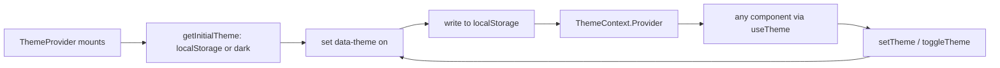

# `src/theme` — Theming

The **dark/light theming** of Rival: a React context that carries the current theme, applies it to the document, and persists it — surfacing a `useTheme` hook the whole app reads.

> **One-sentence purpose:** _Hold one theme value, apply it to the DOM, persist
> it, and let every component read it through a single hook._

```
   ┌────────────────────────┐
   │ theme/ThemeContext     │  (context + getInitialTheme + useTheme)
   ├────────────────────────┤
   │ theme/ThemeProvider    │  (applies data-theme + persists)
   └─────────▲──────────────┘
             │ consumed by components + design-system
```

---

## File-by-file map

| File                | Responsibility                                                                                                                  | Public surface                                                                                           |
| ------------------- | ------------------------------------------------------------------------------------------------------------------------------- | -------------------------------------------------------------------------------------------------------- |
| `ThemeContext.tsx`  | The context, the `Theme` type, initial-theme resolution, and the `useTheme` hook                                                | `THEMES`, `Theme`, `ThemeContext`, `ThemeContextValue`, `getInitialTheme()`, `useTheme()`, `STORAGE_KEY` |
| `ThemeProvider.tsx` | The provider — sets `document.documentElement`'s `data-theme`, persists to `localStorage`, and exposes `setTheme`/`toggleTheme` | `ThemeProvider`, `ThemeProviderProps`                                                                    |

## Flow



The theme is also persisted into the Dexie `settings` table (via the settings viewmodel) so it survives reloads and is included in Drive export.

---

## Cross-package connections (one level deeper)

### Inbound — `theme` imports nothing but React.

### Outbound — who consumes `theme`

| Consumer                              | What it uses                                            |
| ------------------------------------- | ------------------------------------------------------- |
| `src/components`                      | `useTheme` (Loader tints by theme), `ThemeContext`      |
| `src/design-system`                   | theme tokens via `data-theme` on `<html>`               |
| `src/viewmodels/useSettingsViewModel` | `useTheme` + `setTheme` (persisted to Dexie `settings`) |
| `src/shells/screens`                  | via `useTheme` where a themed control is needed         |
| `src/main.tsx`                        | wraps the app in `ThemeProvider`                        |

---

## Testing

Theme behavior is validated through the settings viewmodel tests; the context itself is exercised implicitly by every component render.

```bash
npx vitest run --config vite.config.ts src/viewmodels
```

